<div align="center">

<picture>
  <source media="(prefers-color-scheme: dark)" srcset="assets/header-dark.svg">
  
</picture>

<br>

<a href="https://bytefinch.dev">
  
</a>

<br>

<a href="https://bytefinch.dev"></a>
<a href="https://www.linkedin.com/in/muhammad-umer-shah/"></a>
<a href="https://www.linkedin.com/company/bytefinch-technologies/"></a>
<a href="https://github.com/ByteFinch-Technologies/secretveil"></a>


</div>

<br>

<picture>
  <source media="(prefers-color-scheme: dark)" srcset="assets/section-about-dark.svg">
  
</picture>

<picture>
  <source media="(prefers-color-scheme: dark)" srcset="assets/terminal-dark.svg">
  
</picture>

<br><br>

<picture>
  <source media="(prefers-color-scheme: dark)" srcset="assets/stats-dark.svg">
  
</picture>

<br><br>

<picture>
  <source media="(prefers-color-scheme: dark)" srcset="assets/section-building-dark.svg">
  
</picture>

<picture>
  <source media="(prefers-color-scheme: dark)" srcset="assets/building-dark.svg">
  
</picture>

<br><br>

<picture>
  <source media="(prefers-color-scheme: dark)" srcset="assets/section-featured-dark.svg">
  
</picture>

<picture>
  <source media="(prefers-color-scheme: dark)" srcset="assets/secretveil-dark.svg">
  
</picture>

<div align="center">

<a href="https://github.com/ByteFinch-Technologies/secretveil"></a>
<a href="https://www.npmjs.com/package/secretveil"></a>
<a href="https://github.com/ByteFinch-Technologies/secretveil/blob/main/LICENSE"></a>

```bash
npx secretveil doctor   # run it once, install nothing
```

</div>

<br>

<picture>
  <source media="(prefers-color-scheme: dark)" srcset="assets/section-stack-dark.svg">
  
</picture>

<div align="center">

<br>
<sub><b>LANGUAGES AND FRONTEND</b></sub><br><br>

<picture>
  <source media="(prefers-color-scheme: dark)" srcset="https://skillicons.dev/icons?i=js%2Cts%2Cpy%2Chtml%2Ccss%2Creact%2Cnextjs%2Cangular%2Cvue%2Csvelte%2Ctailwind%2Credux%2Cthreejs%2Cvite&perline=14&theme=dark">
  
</picture>

<br><br>
<sub><b>BACKEND, DATA AND MESSAGING</b></sub><br><br>

<picture>
  <source media="(prefers-color-scheme: dark)" srcset="https://skillicons.dev/icons?i=nodejs%2Cexpress%2Cnestjs%2Cflask%2Cgraphql%2Cprisma%2Cpostgres%2Cmongodb%2Cmysql%2Credis%2Celasticsearch%2Cdynamodb%2Ckafka%2Crabbitmq&perline=14&theme=dark">
  
</picture>

<br><br>
<sub><b>CLOUD, DEVOPS AND TESTING</b></sub><br><br>

<picture>
  <source media="(prefers-color-scheme: dark)" srcset="https://skillicons.dev/icons?i=aws%2Cazure%2Cgcp%2Ccloudflare%2Cvercel%2Cnetlify%2Cfirebase%2Cdocker%2Ckubernetes%2Cterraform%2Cgithubactions%2Cjest%2Cvitest%2Ccypress&perline=14&theme=dark">
  
</picture>

<br><br><sub><b>AI AND AUTOMATION</b></sub><br><br>


</div>

<br>

<picture>
  <source media="(prefers-color-scheme: dark)" srcset="assets/section-journey-dark.svg">
  
</picture>

<picture>
  <source media="(prefers-color-scheme: dark)" srcset="assets/journey-dark.svg">
  
</picture>

<br><br>

<picture>
  <source media="(prefers-color-scheme: dark)" srcset="assets/section-activity-dark.svg">
  
</picture>

<picture>
  <source media="(prefers-color-scheme: dark)" srcset="https://raw.githubusercontent.com/umer-bytefinch/umer-bytefinch/output/activity-dark.svg">
  
</picture>

<br><br>

<div align="center">
  <picture>
    <source media="(prefers-color-scheme: dark)" srcset="https://streak-stats.demolab.com?user=umer-bytefinch&background=0F1A30&border=1E2D4F&stroke=1E2D4F&ring=3B82F6&fire=FBBF24&currStreakNum=F1F5F9&sideNums=F1F5F9&currStreakLabel=60A5FA&sideLabels=94A3B8&dates=64748B&border_radius=24&card_width=1200&card_height=220">
    
  </picture>
</div>

<br>

<picture>
  <source media="(prefers-color-scheme: dark)" srcset="https://raw.githubusercontent.com/umer-bytefinch/umer-bytefinch/output/snake-dark.svg">
  
</picture>

<br><br>

<picture>
  <source media="(prefers-color-scheme: dark)" srcset="assets/section-connect-dark.svg">
  
</picture>

<div align="center">

**Building something for the Gulf, or need a senior engineer who ships?** Say hello.

<a href="https://bytefinch.dev"></a>
<a href="https://www.linkedin.com/in/muhammad-umer-shah/"></a>
<a href="https://github.com/ByteFinch-Technologies"></a>

<br><br>

<picture>
  <source media="(prefers-color-scheme: dark)" srcset="assets/footer-dark.svg">
  
</picture>

</div>
